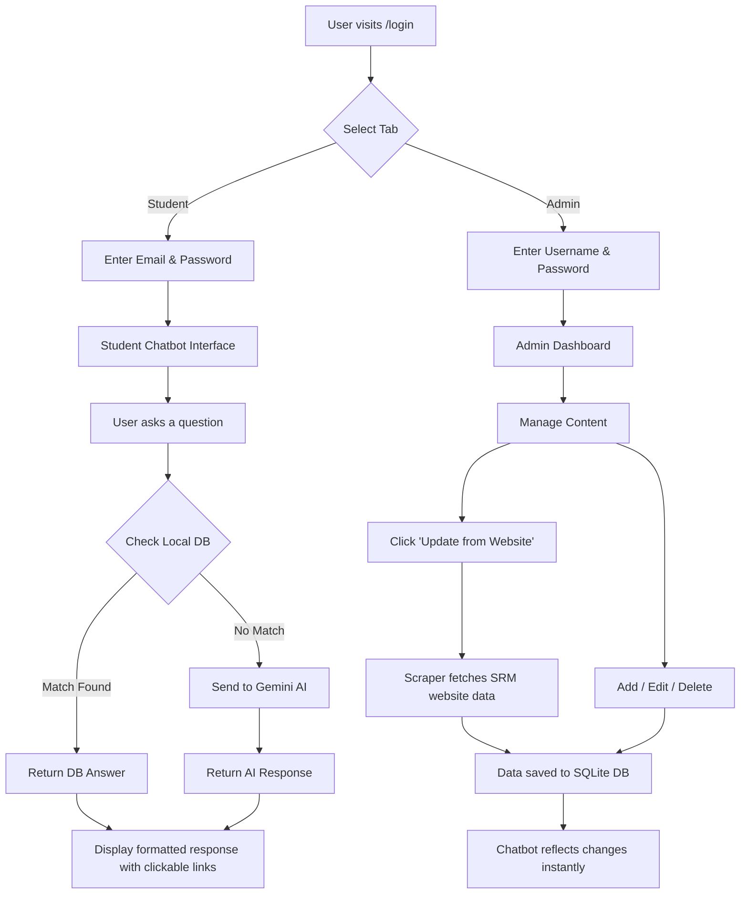

# 🤖 SRM AI Chatbot

An AI-powered university chatbot for **SRM Institute of Science and Technology** that helps students find information about departments, university rules, timetables, hostel details, and campus facilities.

Built with **Python, Flask, SQLite, and Google Gemini AI**, the application uses a **hybrid chatbot architecture**: it searches structured university data first and uses generative AI as a fallback when relevant information is not available locally.

## 🚀 Project Highlights

* 🤖 **Hybrid AI architecture** combining a local knowledge base with Google Gemini
* 🗄️ **Structured university knowledge base** for departments, rules, timetables, hostel information, and facilities
* 🛠️ **Admin dashboard** with CRUD operations for managing university content
* 🌐 **Website data extraction** using BeautifulSoup4 and Requests
* 💬 **Persistent chat history** using SQLite
* 🔐 **Student and Admin authentication** with Flask sessions and password hashing
* 🌙 **Dark mode** and responsive user interface
* 🔗 **Clickable links** in chatbot responses

## ✨ Features

| Feature                 | Description                                                                              |
| ----------------------- | ---------------------------------------------------------------------------------------- |
| 🤖 **AI Chatbot**       | Searches the local database first and falls back to Google Gemini AI                     |
| 🔐 **Dual Login**       | Separate Student and Admin authentication                                                |
| 🛠️ **Admin Dashboard** | CRUD management for Departments, Rules, Timetable, Hostel Info, and Facilities           |
| 🌐 **Web Scraper**      | Retrieves selected information from the SRM website and updates the local knowledge base |
| 🔗 **Clickable Links**  | URLs in responses are formatted as clickable links                                       |
| 🌙 **Dark Mode**        | Toggle between light and dark themes                                                     |
| 💬 **Chat History**     | Conversations can be stored and revisited                                                |
| 📱 **Responsive UI**    | Mobile-friendly chatbot interface with SRM-inspired styling                              |

---


## 🏗️ Tech Stack

- **Backend:** Python, Flask, SQLite
- **Frontend:** HTML5, CSS3, JavaScript
- **AI Provider:** Google Gemini (gemini-flash-latest)
- **Web Scraping:** BeautifulSoup4, Requests
- **Auth:** Flask Sessions, Werkzeug password hashing

---

## 📁 Project Structure

```
srm_ai_chatbot/
├── app.py                  # Main Flask application & routes
├── db_setup.py             # Database schema & initialization
├── scraper.py              # Web scraper for SRM website
├── college_data.json       # Scraped/static college data
├── requirements.txt        # Python dependencies
├── .gitignore
├── .env                    # API keys (not tracked)
│
├── static/
│   ├── css/
│   │   └── style.css       # All styles (auth, chat, admin, dark mode)
│   └── js/
│       └── script.js       # Chat logic, formatting, theme toggle
│
└── templates/
    ├── index.html           # Main chatbot interface
    ├── login.html           # Unified login (Student + Admin tabs)
    ├── register.html        # Student registration
    ├── admin_login.html     # Standalone admin login (legacy)
    └── admin_dashboard.html # Admin panel with CRUD operations
```

---

## 🚀 Getting Started

### Prerequisites
- Python 3.8+
- A Google Gemini API Key ([Get one here](https://aistudio.google.com/apikey))

### Installation

```bash
# 1. Clone the repository
git clone https://github.com/yuvakishorekoppula/srm_ai_chatbot.git
cd srm_ai_chatbot

# 2. Create a virtual environment
python -m venv .venv
.venv\Scripts\activate   # Windows
# source .venv/bin/activate  # macOS/Linux

# 3. Install dependencies
pip install -r requirements.txt

# 4. Create a .env file with your API key
echo GEMINI_API_KEY=your_api_key_here > .env

# 5. Initialize the database
python db_setup.py

# 6. Run the application
python app.py
```

The app will be live at **http://localhost:5000**

### Default Admin Credentials
| Field | Value |
|---|---|
| Username | `admin` |
| Password | `admin123` |

---

## 🔄 Application Workflow



### Detailed Workflow

1. **Authentication Flow**
   - Users visit `/login` and choose between **Student** or **Admin** tab
   - Students register with username, email, and password
   - Admins use pre-configured credentials
   - Sessions are managed via Flask's secure session system

2. **Chatbot Flow (Hybrid Architecture)**
   - Student sends a message
   - System searches dedicated tables (`departments`, `rules`, `timetable`, `hostel`, `facilities`)
   - Falls back to legacy `college_content` table
   - If no local match → query is sent to **Google Gemini AI** with SRM context
   - Response is formatted with clickable links, bold keywords, and proper spacing

3. **Admin Dashboard Flow**
   - Admin logs in → redirected to `/admin/dashboard`
   - Sidebar navigation: Departments | Rules | Timetable | Hostel Info | Facilities
   - Each section supports full **CRUD operations** (Create, Read, Update, Delete)
   - **"Update from Website"** button triggers `scraper.py` which:
     - Scrapes srmist.edu.in for departments and facilities
     - Parses HTML with BeautifulSoup
     - Extracts clean text (no raw HTML)
     - Stores structured data in SQLite database
   - Changes are instantly reflected in the chatbot responses

4. **Data Flow**
   ```
   SRM Website → scraper.py → college_data.json → SQLite DB → Chatbot Response
   Admin Panel → Direct DB Insert/Update/Delete → Chatbot Response
   ```

---

## 🗄️ Database Schema

| Table | Key Columns | Purpose |
|---|---|---|
| `users` | username, email, password_hash | Student accounts |
| `admins` | username, password_hash | Admin accounts |
| `conversations` | user_id, title | Chat session tracking |
| `messages` | conversation_id, role, content | Chat history |
| `departments` | name, description | Department info |
| `rules` | title, description | University rules |
| `timetable` | course_name, schedule | Class schedules |
| `hostel` | name, description | Hostel information |
| `facilities` | name, description | Campus facilities |

---

## 🔒 Security

- Passwords are hashed using **Werkzeug** (PBKDF2)
- Admin routes are protected with session-based authentication
- `.env` file with API keys is excluded from version control
- Links use `rel="noopener noreferrer"` for security
- User input is sanitized before database operations

---

## 🤝 Contributing

1. Fork the repository
2. Create a feature branch (`git checkout -b feature/new-feature`)
3. Commit your changes (`git commit -m 'Add new feature'`)
4. Push to the branch (`git push origin feature/new-feature`)
5. Open a Pull Request

---


**Built with ❤️ for SRM IST Students**
